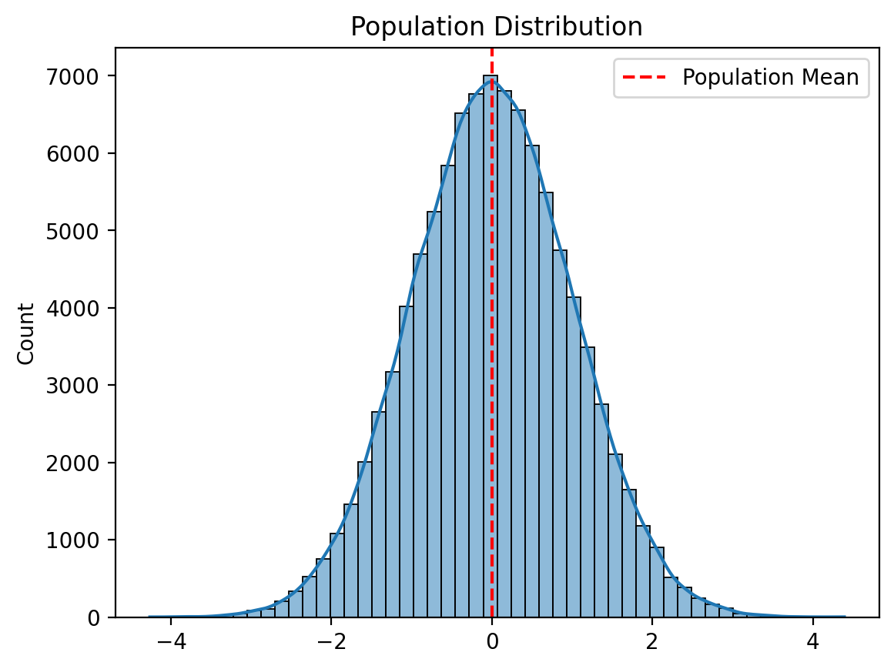
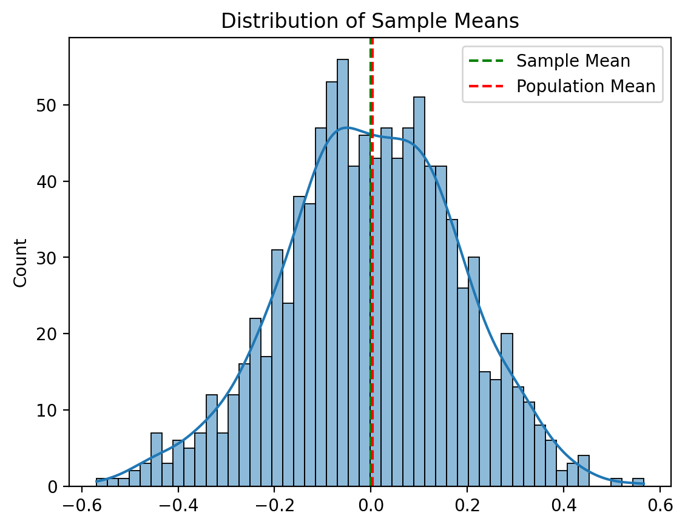
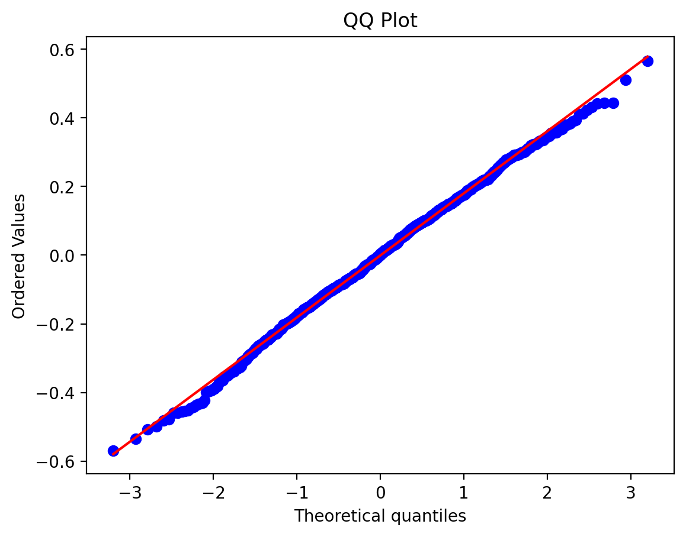
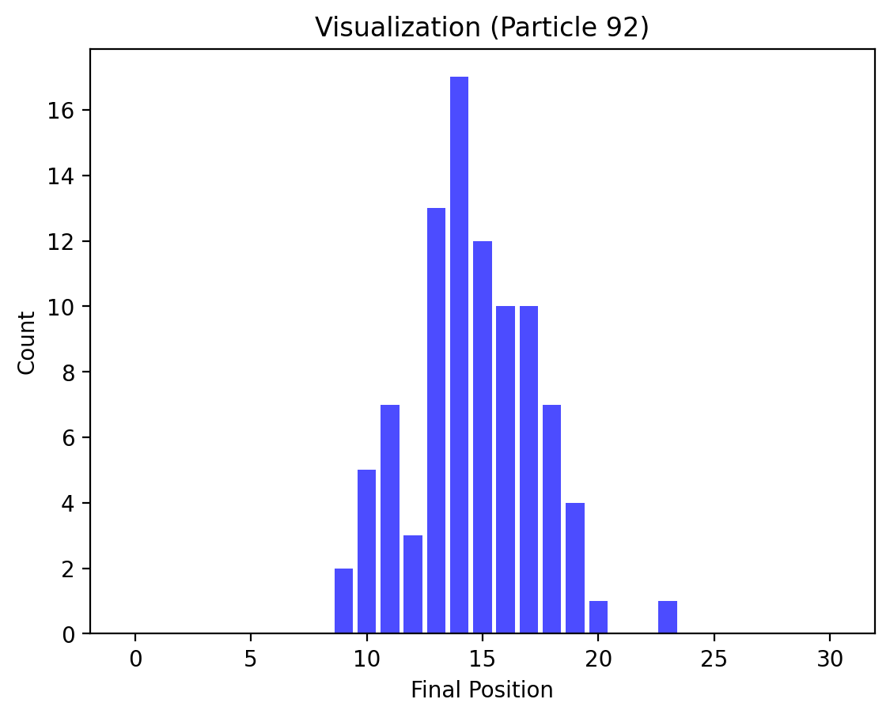

# Central Limit Theorem Visualization

This project is an interactive Streamlit application that demonstrates the Central Limit Theorem (CLT) using various population distributions, sampling techniques, and visualizations. It is designed to help users understand how sample means converge to a normal distribution, regardless of the population distribution, as the sample size increases.

## Features

- **Population Distribution Options:** Select from various distributions, including Normal, Exponential, Uniform, Poisson, Binomial, Log Normal, Beta, Student T, and Chi-Squared.
- **Sampling Parameters:** Adjust sample size, number of samples, and number of bins for visualizations.
- **Dynamic Visualizations:**
  - Population Distribution with kernel density estimation (KDE).
  - Distribution of Sample Means with overlays of theoretical normal curves.
  - QQ Plot for normality testing of sample means.
  - Interactive Visualization simulation to visualize the CLT in action.
- **Summary Statistics:** Display key metrics such as population mean, sample mean, population standard deviation, and sample standard deviation.

## Installation

1. Clone the repository:
   ```bash
   git clone https://github.com/mrunalgangurde/clt-visualization.git
   cd clt-visualization
   ```

2. Install the required Python packages:
   ```bash
   pip install -r requirements.txt
   ```

3. Run the application:
   ```bash
   streamlit run app.py
   ```

## Usage

1. Launch the application using the command above.
2. Use the sidebar to:
   - Select a population distribution.
   - Set parameters for the distribution (e.g., mean, standard deviation).
   - Adjust sampling parameters (sample size, number of samples).
   - Configure visualization settings (number of bins, number of particles for the Galton Board, animation speed).
3. Explore various sections:
   - **Population Distribution:** Understand the characteristics of the selected distribution.
   - **Sample Means Distribution:** Observe how sample means converge to a normal distribution.
   - **Theoretical Curve Comparison:** Compare sample means with the theoretical normal curve.
   - **QQ Plot:** Validate the normality of sample means.
   - **Galton Board Simulation:** Visualize the CLT dynamically with particle simulations.

## Key Concepts

- **Central Limit Theorem:** States that the distribution of sample means approaches a normal distribution as the sample size increases, regardless of the population's original distribution.
- **Population vs. Sample:** Highlights the relationship between population parameters and sample statistics.
- **Visual Demonstrations:** Helps users intuitively grasp statistical concepts through interactive graphs and animations.

## Example Visualizations

### Population Distribution


### Sample Means Distribution


### QQ Plot


### Visualization Simulation


## Technologies Used

- **Python** for data processing and statistical calculations.
- **Streamlit** for interactive web-based visualization.
- **Matplotlib** and **Seaborn** for plotting.
- **NumPy** and **SciPy** for numerical computations.

## Future Enhancements

- Add support for additional population distributions.
- Allow users to upload custom datasets for population generation.
- Implement export options for visualizations and summary statistics.

## Contributing

Contributions are welcome! Feel free to fork the repository, submit pull requests, or open issues for discussion.

## License

This project is licensed under the MIT License.

## Contact

For questions or feedback, please reach out via [mrunalgangurde22@gmail.com](mailto:mrunalgangurde22@gmail.com) or open an issue on GitHub.

